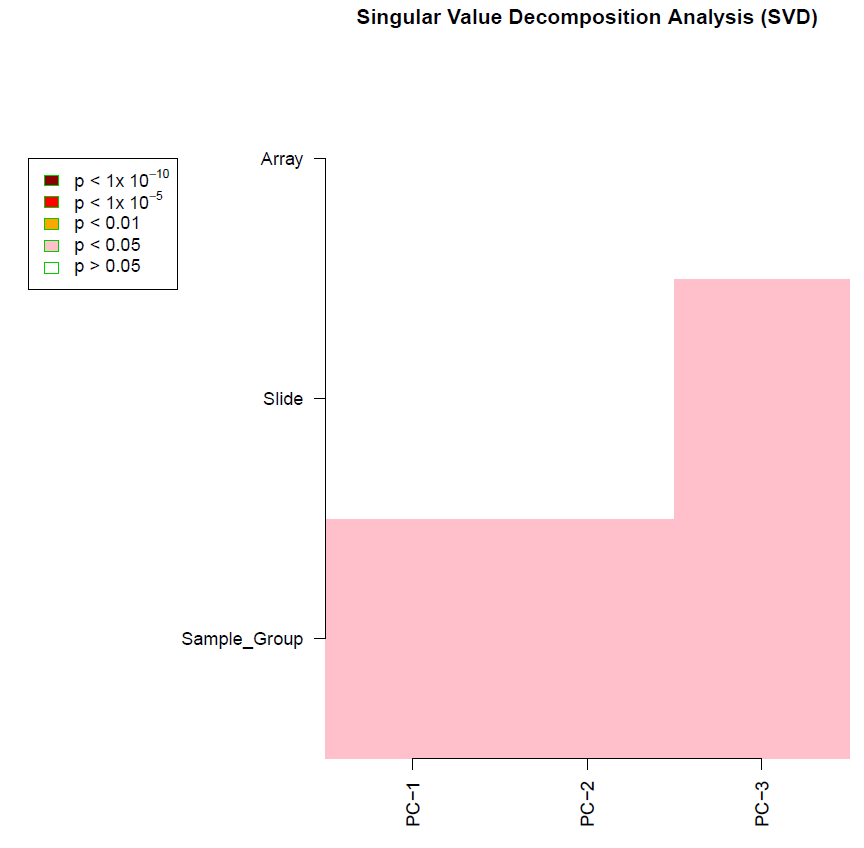
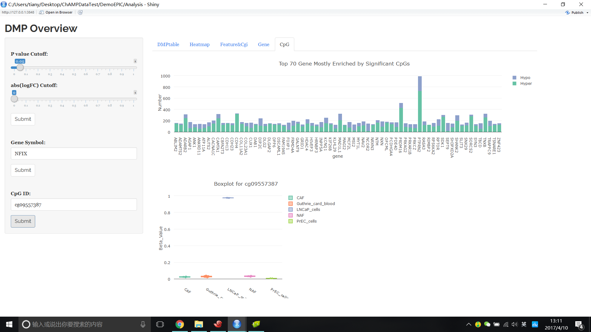
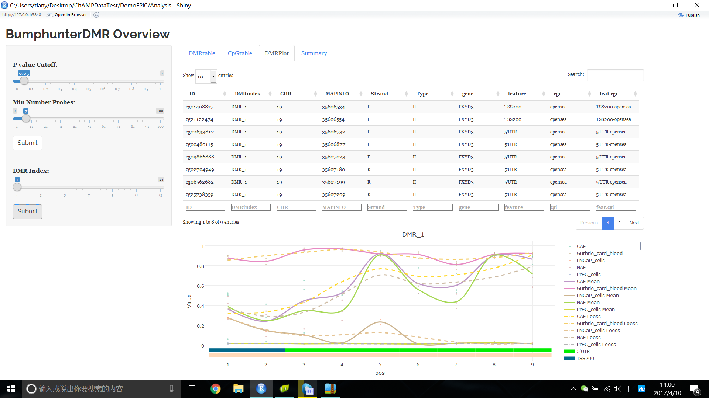
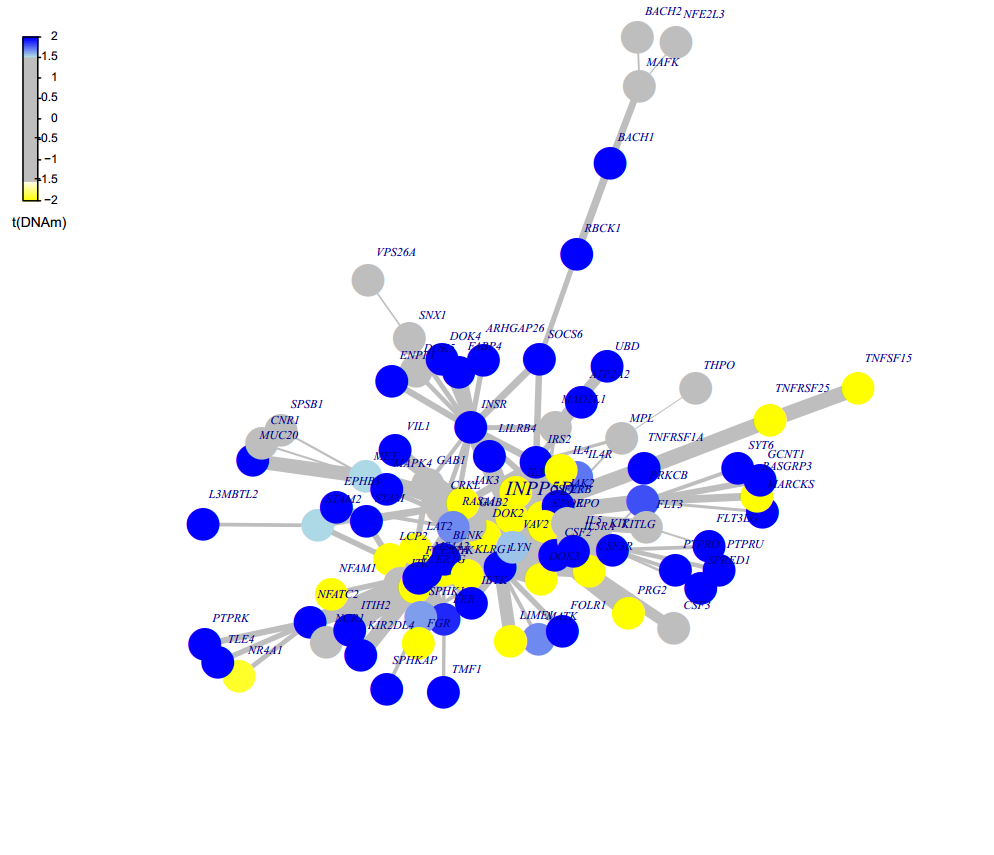

# DemoEPIC DataSet

This EPIC data set contains 15 samples, 3 CAF, 5 Guthrie_card_blood, 2 LNCaP_cells, 3 NAF, 2 PrEC_cells, which is used for testing EPIC dataset with ChAMP.

## Code：
``` r
myLoad <- champ.load(directory = "../Data",arraytype = "EPIC")
CpG.GUI(arraytype="EPIC")
myNorm <- champ.norm(arraytype="EPIC")
myNorm_2 <- champ.norm(method="PBC",arraytype = "EPIC")
myNorm_3 <- champ.norm(method="SWAN",arraytype = "EPIC")
QC.GUI(arraytype="EPIC")
champ.SVD(beta=myNorm)
myDMP <- champ.DMP(arraytype = "EPIC")
DMP.GUI()
myDMR <- champ.DMR(arraytype = "EPIC")
myDMR_2 <- champ.DMR(arraytype = "EPIC",method="DMRcate",cores=1)
myDMR_3 <- champ.DMR(arraytype = "EPIC",method="ProbeLasso")
DMR.GUI(arraytype="EPIC")
DMR.GUI(myDMR_2,arraytype="EPIC")
DMR.GUI(myDMR_3,arraytype="EPIC")
myGSEA <- champ.GSEA(arraytype = "EPIC")
myBlock <- champ.Block(arraytype = "EPIC")
Block.GUI(arraytype="EPIC")
myEpiMod <- champ.EpiMod(arraytype="EPIC")
myrefbase <- champ.refbase(arraytype = "EPIC")
myreffree <- champ.reffree()
myCNA <- champ.CNA(control = F,arraytype = "EPIC")
```


### champ.load() result
``` r
> myLoad <- champ.load(directory = "../Data",arraytype = "EPIC")
[===========================]
[<<<< ChAMP.LOAD START >>>>>]
-----------------------------
Loading data from ../Data
[read.metharray.sheet] Found the following CSV files:

[1] "../Data/Yuan_Tian_EPIC_PD_File.csv"
<< Read DataSet Success. >>

The fraction of failed positions per sample
 
            (You may need to delete samples with high proportion of failed probes
): 
           Failed CpG Fraction.
GSM2309170         0.0007521607
GSM2309171         0.0007452390
GSM2309172         0.0006379523
GSM2309173         0.0005964219
GSM2309174         0.0007660042
GSM2309175         0.0097400200
GSM2309176         0.0010036501
GSM2309177         0.0010982470
GSM2309178         0.0010636383
GSM2309179         0.0010763282
GSM2309180         0.0012828263
GSM2309181         0.0013208958
GSM2309182         0.0008075345
GSM2309183         0.0008063809
GSM2309184         0.0010659456
Filtering probes with a detection p-value above 0.01 in one or more samples has removed 11176 probes from the analysis. If a large number of probes have been removed, ChAMP suggests you to identify potentially bad samples.
<< Filter DetP Done. >>

Filtering probes with a beadcount <3 in at least 5% of samples, has removed 19994 from the analysis.
<< Filter Beads Done. >>

Filtering non-cg probes, has removed 2831 from the analysis.
<< Filter NoCG Done. >>

Using general EPIC SNP list for filtering.
Filtering probes with SNPs as identified in Zhou's Nucleic Acids Research Paper, 2016, has removed 77704 from the analysis.
<< Filter SNP Done. >>

Filtering probes that align to multiple locations as identified in Nordlund et al, has removed 47 from the analysis.
<< Filter MultiHit Done. >>

Filtering probes on the X or Y chromosome has removed 16610 from the analysis.
<< Filter XY chromosome Done. >>

[Beta value is selected as output.]

Zeros in your dataset have been replaced with smallest positive value.

One in your dataset have been replaced with largest value below 1.

The analysis will be proceed with 738474 probes and 15 samples.

[<<<<< ChAMP.LOAD END >>>>>>]
[===========================]
[You may want to process champ.QC() next.]

There were 50 or more warnings (use warnings() to see the first 50)
> 
```

### CpG.GUI() Result


### champ.norm() Result
``` r
> myNorm <- champ.norm(arraytype = "EPIC")
[===========================]
[>>>>> ChAMP.NORM START <<<<<<]
-----------------------------
champ.norm Results will be saved in ./CHAMP_Normalization/
[ SWAN method call for BOTH rgSet and mset input, FunctionNormalization call for rgset only , while PBC and BMIQ only needs beta value. Please set parameter correctly. ]

<< Normalizing data with BMIQ Method >>
Note that,BMIQ function may fail for bad quality samples (Samples did not even show beta distribution).
3 cores will be used to do parallel BMIQ computing.
[>>>>> ChAMP.NORM END <<<<<<]
[===========================]
[You may want to process champ.SVD() next.]

Warning message:
In dir.create(resultsDir) : '.\CHAMP_Normalization' already exists
>
```

``` r
> myNorm_2 <- champ.norm(method="PBC",arraytype = "EPIC")
[===========================]
[>>>>> ChAMP.NORM START <<<<<<]
-----------------------------
champ.norm Results will be saved in ./CHAMP_Normalization/
[ SWAN method call for BOTH rgSet and mset input, FunctionNormalization call for rgset only , while PBC and BMIQ only needs beta value. Please set parameter correctly. ]

<< Normalizing data with PBC Method >>
[1] "Done for sample 1"
[1] "Done for sample 2"
[1] "Done for sample 3"
[1] "Done for sample 4"
[1] "Done for sample 5"
[1] "Done for sample 6"
[1] "Done for sample 7"
[1] "Done for sample 8"
[1] "Done for sample 9"
[1] "Done for sample 10"
[1] "Done for sample 11"
[1] "Done for sample 12"
[1] "Done for sample 13"
[1] "Done for sample 14"
[1] "Done for sample 15"
[>>>>> ChAMP.NORM END <<<<<<]
[===========================]
[You may want to process champ.SVD() next.]

Warning message:
In dir.create(resultsDir) : '.\CHAMP_Normalization' already exists
```

``` r
> myNorm_3 <- champ.norm(method="SWAN",arraytype = "EPIC")
[===========================]
[>>>>> ChAMP.NORM START <<<<<<]
-----------------------------
champ.norm Results will be saved in ./CHAMP_Normalization/
[ SWAN method call for BOTH rgSet and mset input, FunctionNormalization call for rgset only , while PBC and BMIQ only needs beta value. Please set parameter correctly. ]

[>>>>> ChAMP.NORM END <<<<<<]
[===========================]
[You may want to process champ.SVD() next.]

Warning message:
In dir.create(resultsDir) : '.\CHAMP_Normalization' already exists
```

### QC.GUI() Result


### champ.SVD() Result
``` r
> 
> champ.SVD(beta=myNorm)
[===========================]
[<<<<< ChAMP.SVD START >>>>>]
-----------------------------
champ.SVD Results will be saved in ./CHAMP_SVDimages/ .

[SVD analysis will be proceed with 738474 probes and 15 samples.]


[ champ.SVD() will only check the dimensions between data and pd, instead if checking if Sample_Names are correctly matched (because some user may have no Sample_Names in their pd file),thus please make sure your pd file is in accord with your data sets (beta) and (rgSet).]

<< Following Factors in your pd(sample_sheet.csv) will be analysised: >>
<Sample_Group>(factor):LNCaP_cells, PrEC_cells, CAF, NAF, Guthrie_card_blood
<Array>(factor):R03C01, R04C01, R01C01, R02C01, R05C01, R06C01, R07C01, R08C01
<Slide>(factor):200134080018, 200134080009, 200134080015, 200134080019
[champ.SVD have automatically select ALL factors contain at least two different values from your pd(sample_sheet.csv), if you don't want to analysis some of them, please remove them manually from your pd variable then retry champ.SVD().]

<< Following Factors in your pd(sample_sheet.csv) will not be analysis: >>
<Sample_Name>
<Sample_Plate>
<Pool_ID>
<Project>
<Sample_Well>
<Basename>
<filenames>
[Factors are ignored because they only indicate Name or Project, or they contain ONLY ONE value across all Samples.]

<< PhenoTypes.lv generated successfully. >>
<< Calculate SVD matrix successfully. >>
<< Plot SVD matrix successfully. >>
[<<<<<< ChAMP.SVD END >>>>>>]
[===========================]
[If the batch effect is not significant, you may want to process champ.DMP() or champ.DMR() or champ.BlockFinder() next, otherwise, you may want to run champ.runCombat() to eliminat batch effect, then rerun champ.SVD() to check corrected result.]

> 
```



### champ.runCombat Result
This data set can not be performed batch correction, because "Slide" factor in pd file contains phenotypes below:
``` r
> table(myLoad$pd$Slide)

200134080009 200134080015 200134080018 200134080019 
           8            2            4            1 
>
```
Phenotype 200134080019 contains only one variable, not able to be corrected by Combat algorithm. However, even if we remove phenotype 200134080019 related samples, it's still not working, because Combat function, defined by SVA package and paper, requirs that there MUST NOT have any confounding effect between covariates about to be analysied and batches to be corrected. So to say aftering modeling covariate "Sample_Group" and batch "Slide", the modeled matrix MUST be a Full Rank Matrix.

Now let's make a test below:
``` r
> table(myLoad$pd$Sample_Group,myLoad$pd$Slide)
                    
                     200134080009 200134080015 200134080018 200134080019
  CAF                           3            0            0            0
  Guthrie_card_blood            2            2            0            1
  LNCaP_cells                   0            0            2            0
  NAF                           3            0            0            0
  PrEC_cells                    0            0            2            0
> 
```
Now we can see that in above matrix, column 200134090015 actually can be represented by 200134080019 column. Also, we can see all PrEC_cells samples are 200134080018 column. So to say, "Sample_Group" and "Slide" here are strongly confounded with each other. It's not our program's probem that champ.runCombat() is not working, but actually the data's status is not fulfilled.

### champ.DMP() Result
``` r
> myDMP <- champ.DMP(arraytype = "EPIC")
[===========================]
[<<<<< ChAMP.DMP START >>>>>]
-----------------------------
<< Your pheno information contains following groups. >>
<LNCaP_cells>:2 samples.
<PrEC_cells>:2 samples.
<CAF>:3 samples.
<NAF>:3 samples.
<Guthrie_card_blood>:5 samples.
[The power of statistics analysis on groups contain very few samples may not strong.]
You did not assign compare groups. The first two groups: <LNCaP_cells> and <PrEC_cells>, will be compared automatically.

<< Contrast Matrix >>
              Contrasts
Levels         pPrEC_cells-pLNCaP_cells
  pLNCaP_cells                       -1
  pPrEC_cells                         1

<< All beta, pheno and model are prepared successfully. >>
You have found 459461 significant MVPs with a BH adjusted P-value below 0.05.

<< Calculate DMP successfully. >>
[<<<<<< ChAMP.DMP END >>>>>>]
[===========================]
[You may want to process DMP.GUI() or champ.GSEA() next.]

> 
```


### DMP.GUI() Result



### champ.DMR() Result
``` r
> myDMR <- champ.DMR(arraytype = "EPIC")
[===========================]
[<<<<< ChAMP.DMR START >>>>>]
-----------------------------
<< Find DMR with Bumphunter Method >>
3 cores will be used to do parallel BMIQ computing.
According to your data set, champ.DMR() detected 10960 clusters contains MORE THAN 7 probes within300 maxGap. These clusters will be used to find DMR.

[bumphunterEngine] Parallelizing using 3 workers/cores (backend: doParallelSNOW, version: 1.0.10).
[bumphunterEngine] Computing coefficients.
[bumphunterEngine] Smoothing coefficients.
[bumphunterEngine] Performing 250 bootstraps.
[bumphunterEngine] Computing marginal bootstrap p-values.
[bumphunterEngine] Smoothing bootstrap coefficients.
[bumphunterEngine] cutoff: 0.815
[bumphunterEngine] Finding regions.
[bumphunterEngine] Found 444 bumps.
[bumphunterEngine] Computing regions for each bootstrap.
[bumphunterEngine] Estimating p-values and FWER.
<< Calculate DMR success. >>
Bumphunter detected 13 DMRs with P value <= 0.05.
[<<<<<< ChAMP.DMR END >>>>>>]
[===========================]
[You may want to process DMR.GUI() or champ.GSEA() next.]

Warning messages:
1: closing unused connection 8 (<-DESKTOP-26D1MIT:11420) 
2: closing unused connection 7 (<-DESKTOP-26D1MIT:11420) 
3: closing unused connection 6 (<-DESKTOP-26D1MIT:11420) 
> 
```

``` r
> myDMR_2 <- champ.DMR(arraytype = "EPIC",method="DMRcate",cores=1)
[===========================]
[<<<<< ChAMP.DMR START >>>>>]
-----------------------------
1 cores will be used to do parallel DMRcate computing.
<< Find DMR with DMRcate Method >>
Your contrast returned 234748 individually significant probes. We recommend the default setting of pcutoff in dmrcate().
Fitting chr1...
Fitting chr10...
Fitting chr11...
Fitting chr12...
Fitting chr13...
Fitting chr14...
Fitting chr15...
Fitting chr16...
Fitting chr17...
Fitting chr18...
Fitting chr19...
Fitting chr2...
Fitting chr20...
Fitting chr21...
Fitting chr22...
Fitting chr3...
Fitting chr4...
Fitting chr5...
Fitting chr6...
Fitting chr7...
Fitting chr8...
Fitting chr9...
Demarcating regions...
Done!
DMRcate detected 7343 DMRs with mafcut as= 0.05.
[<<<<<< ChAMP.DMR END >>>>>>]
[===========================]
[You may want to process DMR.GUI() or champ.GSEA() next.]

Warning messages:
1: In if (arraytype == "450K") { :
  the condition has length > 1 and only the first element will be used
2: In if (arraytype == "EPIC") { :
  the condition has length > 1 and only the first element will be used
> 
```

``` r
> myDMR_3 <- champ.DMR(arraytype = "EPIC",method="ProbeLasso")
[===========================]
[<<<<< ChAMP.DMR START >>>>>]
-----------------------------
champ.DMR Results will be saved in ./CHAMP_ProbeLasso/
<< Find DMR with ProbeLasso Method >>
[===========================]
[<<<<< ChAMP.DMP START >>>>>]
-----------------------------
<< Your pheno information contains following groups. >>
<LNCaP_cells>:2 samples.
<PrEC_cells>:2 samples.
<CAF>:3 samples.
<NAF>:3 samples.
<Guthrie_card_blood>:5 samples.
[The power of statistics analysis on groups contain very few samples may not strong.]
You did not assign compare groups. The first two groups: <LNCaP_cells> and <PrEC_cells>, will be compared automatically.

<< Contrast Matrix >>
              Contrasts
Levels         pPrEC_cells-pLNCaP_cells
  pLNCaP_cells                       -1
  pPrEC_cells                         1

<< All beta, pheno and model are prepared successfully. >>
You have found 738474 significant MVPs with a BH adjusted P-value below 1.

<< Calculate DMP successfully. >>
[<<<<<< ChAMP.DMP END >>>>>>]
[===========================]
[You may want to process DMP.GUI() or champ.GSEA() next.]

<< Get closestProbe for each Probe >>
<< Get lassoQuantileThreshold for each featureCgi >>
<< Get expend ranges for each probe >>
<< Get DMR from overlapped probes >>
<< Get adjusted P value for DMR >>
<< Get Start-End Ranges for each DMR >>
<< Calculate Methylation Scores for each DMR >>
<< Generate Probe-level Data >>
<< Generate DMR metadata >>
ProbeLasso detected 2071 DMRs with P value <= 0.05.
[<<<<<< ChAMP.DMR END >>>>>>]
[===========================]
[You may want to process DMR.GUI() or champ.GSEA() next.]

There were 28 warnings (use warnings() to see them)
>
```


### DMR.GUI() Result



### champ.GSEA() Result
``` r
> myGSEA <- champ.GSEA(arraytype = "EPIC")
[===========================]
[<<<< ChAMP.GSEA START >>>>>]
-----------------------------
Loading required package: IlluminaHumanMethylationEPICanno.ilm10b2.hg19

Attaching package: 'IlluminaHumanMethylationEPICanno.ilm10b2.hg19'

The following objects are masked from 'package:IlluminaHumanMethylation450kanno.ilmn12.hg19':

    Islands.UCSC, Locations, Manifest, Other, SNPs.132CommonSingle, SNPs.135CommonSingle,
    SNPs.137CommonSingle, SNPs.138CommonSingle, SNPs.141CommonSingle, SNPs.142CommonSingle,
    SNPs.144CommonSingle, SNPs.146CommonSingle, SNPs.147CommonSingle, SNPs.Illumina

<< Prepare Gene List Ready  >>
<< Start Do GSEA on each Gene List  >>
<< Do GSEA on Gene list DMP>>
goseq method will be used to do GSEA
This method is supported by goseq package, which is developed to address inequalivalent issue between number of CpGs and genes.
Fetching GO annotations...
For 8443 genes, we could not find any categories. These genes will be excluded.
To force their use, please run with use_genes_without_cat=TRUE (see documentation).
This was the default behavior for version 1.15.1 and earlier.
Calculating the p-values...
'select()' returned 1:1 mapping between keys and columns
<< Done for Gene list DMP >>
<< Do GSEA on Gene list DMR>>
goseq method will be used to do GSEA
This method is supported by goseq package, which is developed to address inequalivalent issue between number of CpGs and genes.
Fetching GO annotations...
For 8443 genes, we could not find any categories. These genes will be excluded.
To force their use, please run with use_genes_without_cat=TRUE (see documentation).
This was the default behavior for version 1.15.1 and earlier.
Calculating the p-values...
'select()' returned 1:1 mapping between keys and columns
<< Done for Gene list DMR >>
[<<<<< ChAMP.GSEA END >>>>>>]
[===========================]
Warning messages:
1: In pcls(G) : initial point very close to some inequality constraints
2: In pcls(G) : initial point very close to some inequality constraints
```

### champ.Block() Result
``` r
> myBlock <- champ.Block(arraytype = "EPIC")
[===========================]
[<<<< ChAMP.Block START >>>>]
-----------------------------
<< Load Annotation Successfully >>
<< Get Clusters by cgi-info Successfully >>
<< Calculate Average Beta Value Successfully >>
<< Generate Block Position Successfully >>
<< New Clusters are generated for blocks >>
<< Generate information for New Clusters >>
[bumphunterEngine] Parallelizing using 3 workers/cores (backend: doParallelSNOW, version: 1.0.10).
[bumphunterEngine] Computing coefficients.
[bumphunterEngine] Smoothing coefficients.
[bumphunterEngine] Performing 500 permutations.
[bumphunterEngine] Computing marginal permutation p-values.
[bumphunterEngine] Smoothing permutation coefficients.
[bumphunterEngine] cutoff: 0.019
[bumphunterEngine] Finding regions.
[bumphunterEngine] Found 970 bumps.
[bumphunterEngine] Computing regions for each permutation.
[bumphunterEngine] Estimating p-values and FWER.
<< Run Bumphunter Successfully >>
[<<<<< ChAMP.BLOCK END >>>>>]
[===========================]
[You may want to process Block.GUI() next.]

> 
```
### Block.GUI() Result


### champ.EpiMod() Result


### champ.refase() Result
Actulaly this EPIC data is not suitable to do Reference-Based Correction, So here we just run it to show ChAMP support EPIC data on champ.refbase() fully.
``` r
> myrefbase <- champ.refbase(arraytype = "EPIC")
[===========================]
[<<< ChAMP.REFBASE START >>>]
-----------------------------
<< Load projectWBC function success. >>
Mean value for each estimated Cell Proportion:
      CD8T       CD4T         NK      Bcell       Mono       Gran 
0.02501728 0.26413407 0.04107754 0.18444753 0.22614489 0.25917869 
CD8T has smallest cell proportion, all other cell proportions will be corrected by linear regression method.
All cell proportion influence except the one with least cell proportion get corrected.

[<<<< ChAMP.REFBASE END >>>>]
[===========================]
> 
```

### champ.reffree() Result
``` r
> myreffree <- champ.reffree()
[===========================]
[<<< ChAMP.REFFREE START >>>]
-----------------------------
<< Measure numbers of latent variables success >>
champ.reffree will proceed with 3 components.
10 
20 
30 
40 
50 
<< Calculate RefFreeEWASModel Success >>
Generate p value and q value success.
[<<<< ChAMP.REFBASE END >>>>]
[===========================]
> 
```

### champ.CNA() Result
``` r
> myCNA <- champ.CNA(control = F,arraytype = "EPIC")
[===========================]
[<<<<< ChAMP.CNA START >>>>>]
-----------------------------
champ.CNA Results will be saved in ./CHAMP_CNA .

ChaMP.CNA does not provide batch Correct on intensity data now, but you can use champ.runCombat to correct slides batch yourself.
<< Calculate mean value difference between each sample to mean all samples >>
<< Generate CHR and MAPINFO information >>
<< Processing Samples >>
Analyzing: GSM2309170.qn 
Analyzing: GSM2309171.qn 
Analyzing: GSM2309172.qn 
Analyzing: GSM2309173.qn 
Analyzing: GSM2309174.qn 
Analyzing: GSM2309175.qn 
Analyzing: GSM2309176.qn 
Analyzing: GSM2309177.qn 
Analyzing: GSM2309178.qn 
Analyzing: GSM2309179.qn 
Analyzing: GSM2309180.qn 
Analyzing: GSM2309181.qn 
Analyzing: GSM2309182.qn 
Analyzing: GSM2309183.qn 
Analyzing: GSM2309184.qn 
<< Processing Groups >>
Analyzing: GSM2309170.LNCaP_cells.qn 
Analyzing: GSM2309171.LNCaP_cells.qn 
Analyzing: GSM2309172.PrEC_cells.qn 
Analyzing: GSM2309173.PrEC_cells.qn 
Analyzing: GSM2309174.CAF.qn 
Analyzing: GSM2309175.CAF.qn 
Analyzing: GSM2309176.CAF.qn 
Analyzing: GSM2309177.NAF.qn 
Analyzing: GSM2309178.NAF.qn 
Analyzing: GSM2309179.NAF.qn 
Analyzing: GSM2309180.Guthrie_card_blood.qn 
Analyzing: GSM2309181.Guthrie_card_blood.qn 
Analyzing: GSM2309182.Guthrie_card_blood.qn 
Analyzing: GSM2309183.Guthrie_card_blood.qn 
Analyzing: GSM2309184.Guthrie_card_blood.qn 
[<<<<<< ChAMP.CNA END >>>>>>]
[===========================]
```

